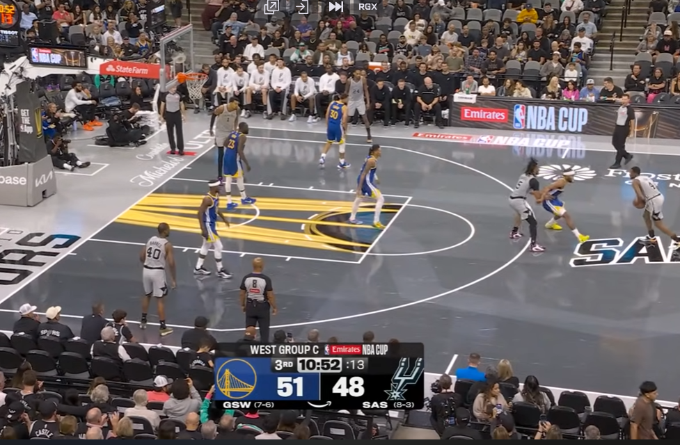
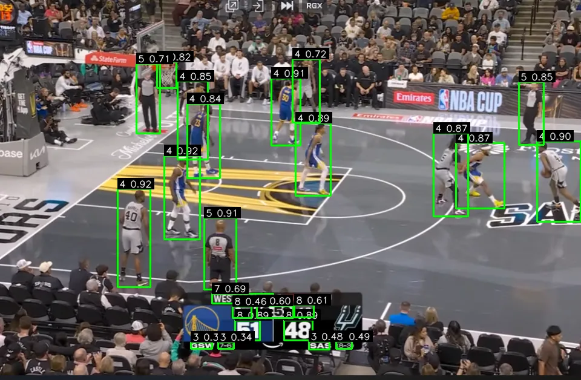
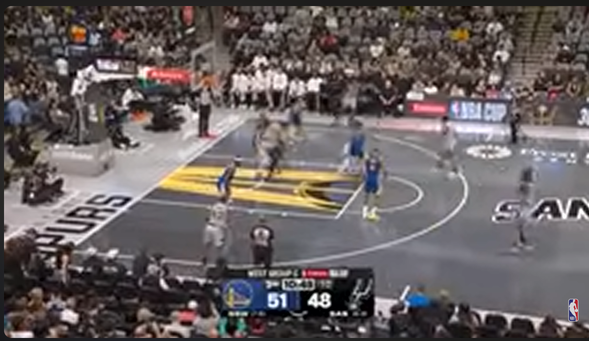
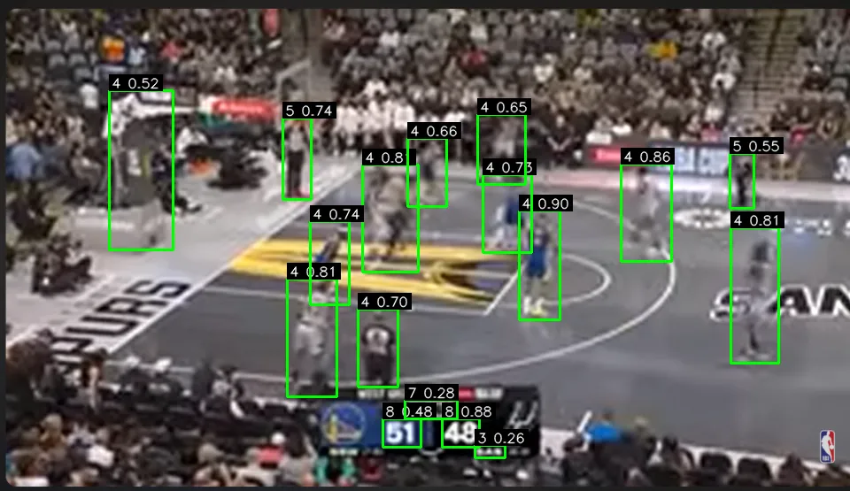
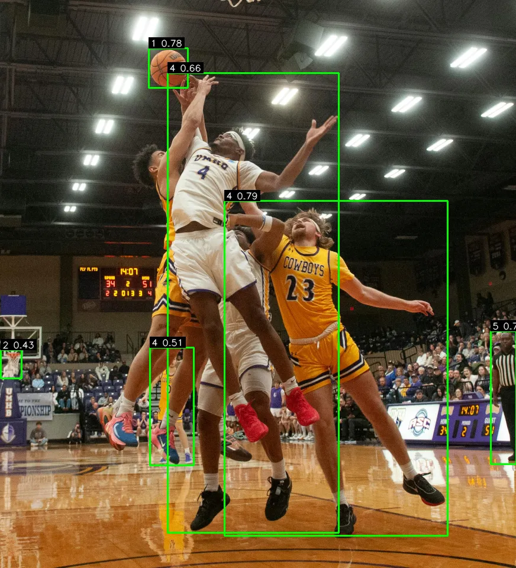

# Basketball Player Detection with RF-DETR  
**Final Project — Artificial Intelligence**

**Authors:** Andres Restrepo Botero, Juan Jose Sanchez Sanchez, Samuel Lopera Torre  
**Python:** 3.11+  
**Dependencies:** PyTorch ≥ 2.0, torchvision ≥ 0.15, rfdetr, OpenCV, Gradio
---

## 0. Explanation Video
<iframe width="560" height="315" src="https://www.youtube.com/embed/1hMdCB8-_oI?si=abwOUkGPBGTNKX8g" allow="accelerometer; autoplay; clipboard-write; encrypted-media; gyroscope; picture-in-picture" allowfullscreen></iframe>

---

## 1. Project Overview

This project implements a complete workflow for detecting basketball players in real game scenes.  
The system is based on **RF-DETR**, a transformer-based object detection architecture. The workflow includes dataset acquisition, data preprocessing, model training, evaluation, and deployment through an interactive web interface.

The application allows users to upload an image and receive annotated bounding boxes identifying all detected objects. Confidence and IoU thresholds can be adjusted in real time, and different weight files can be selected for testing and comparison.

---

## 2. Dataset Description

The dataset was obtained from **Roboflow** and includes COCO-format annotations for multiple object categories relevant to basketball game analysis.  
Every annotated object includes bounding box coordinates and an associated class ID.

### 2.1 Dataset Label IDs

```json
[
  {"id": 0, "name": "basketball-players", "supercategory": "none"},
  {"id": 1, "name": "Ball",            "supercategory": "basketball-players"},
  {"id": 2, "name": "Hoop",            "supercategory": "basketball-players"},
  {"id": 3, "name": "Period",          "supercategory": "basketball-players"},
  {"id": 4, "name": "Player",          "supercategory": "basketball-players"},
  {"id": 5, "name": "Ref",             "supercategory": "basketball-players"},
  {"id": 6, "name": "Shot Clock",      "supercategory": "basketball-players"},
  {"id": 7, "name": "Team Name",       "supercategory": "basketball-players"},
  {"id": 8, "name": "Team Points",     "supercategory": "basketball-players"},
  {"id": 9, "name": "Time Remaining",  "supercategory": "basketball-players"}
]
```

### 2.2 Preprocessing and Data Augmentation

Se realizó aumentado de datos con **zoom** y **blur** sobre las imágenes, tomando en cuenta la naturaleza de la calidad de los *streamings* de basketball.

In practice:

- Zoom augmentations simulate different camera distances and framing.
- Blur augmentations simulate compression artifacts and motion blur typical in streamed matches.
- These augmentations improve robustness to real broadcast conditions.

The dataset is downloaded locally into a directory similar to:

```
Basketball-Players-1/
```

---

## 3. Model Training

Model training is carried out in the notebook **Proyecto.ipynb** using the RF-DETR base model.

### 3.1 Training Steps

1. Download the dataset from Roboflow in COCO format.
2. Initialize RF-DETR:
   ```python
   model = RFDETRBase()
   ```
3. Train the model using the following configuration:
   - Epochs: **10**
   - Batch size: **4**
   - Gradient accumulation: **4**
   - Learning rate: **1e-4**
   - Dataset directory: `Basketball-Players-1/`
   - Output directory: `Basket-Model/`

### 3.2 Output Weights

The training process generates checkpoints, including the primary model used for deployment:

```
Basket-Model/checkpoint_best_total.pth
```

A test inference on `TEST.jpg` is included in the notebook to verify that training completed successfully.

---

## 4. Application & Deployment

Deployment is implemented in the script **App.py**, which provides an interactive detection interface through Gradio.

### 4.1 Application Features

- Loads trained RF-DETR weights selected from a dropdown menu.
- Applies confidence and IoU thresholds controlled by sliders.
- Performs Non-Maximum Suppression (NMS) on RF-DETR outputs.
- Provides a fully interactive inference interface.
- Returns annotated images with bounding boxes and detection labels.

### 4.2 Running Locally

Install the dependencies:

```bash
pip install -r requirements.txt
```

Run the app:

```bash
python App.py --port 8080
```

Access the interface:

```
http://localhost:8080
```

### 4.3 Deployment Notes

- Ensure the directory `Basket-Model/` containing `checkpoint_best_total.pth` is available.
- All dependencies listed in `requirements.txt` must be installed.
- The application can be run locally, on a server, or deployed through Lightning AI using the same codebase.

---

## 5. Demo Pictures

### Example 1: Model detection on sample game frame





### Example 2: Model detection over blurred image




### Example 3: Cinematic example





---

## 6. Repository Structure

```
project-root/
├── Proyecto.ipynb                 # Training notebook (dataset, training, testing)
├── App.py                         # Gradio-based deployment script
├── requirements.txt               # Dependencies
└── README.md                      # Project documentation
```

---

## 7. Final Consideration

For filesize reasons, neither the Dataset or the model Weights are included in this repository, they model weights can be found in our [HuggingFace Page](https://huggingface.co/Senshi5620/BasketballStreamingDetection/tree/main)
